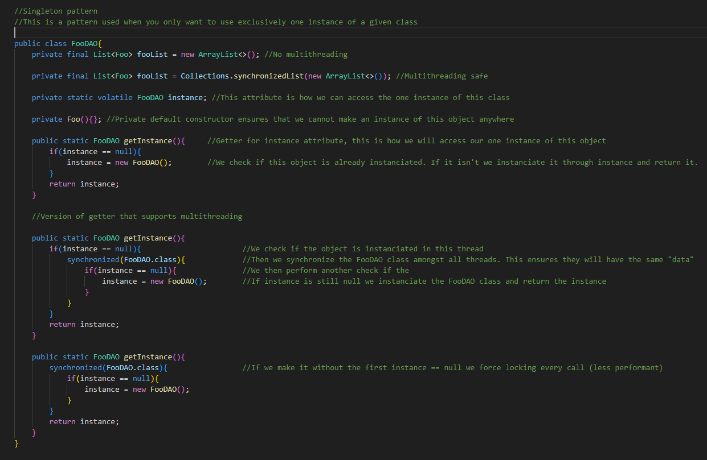

# Naslov

- Vaje 30%
- Pisni izpit 40%
- Ustni izpit 30%

### Analiza zahtev (KAJ?)

### Načrtovanje (KAKO?)

### Implementacija (Kodiranje)

### Testiranje (Tip Verifikacije)

### Vzdrževanje (Popravljanja && Razsiritve)

## Načrtovanje
 - **UML**
 - **C4**
 - **ADL (AADL,..)**
 - **Namestitveni diagrami**
 - **"Lastniske"**

## Glavni namen arhitekture

**Včasih:** monolitni manjši programi 

**Danes:** porazdeljena okolja z različnimi tehnološkimi rešitvami

Obvladujemo kompleksnost 

Zelimo cim vecjo modularnost ampak cim manjso sklopljenost. Torej hocemo da je nasa koda cim manj "dependant" na neko drugo modularno kodo

### Načrt vs Arhitektura

Načrt je bolj dehnične narave za razliko od arhitekture. 

Arhitekture definirajo bolj nefunkcionalne zahteve

Psevdokot ali UMLK sodi med nacrtovanje

Nas najbolj zanimajo deployment diagrami in komponentni diagrami

## 2. Predavanje

#### VAO (Value data object)
Drzi samo podatke

Deklaracija funkcij ki jih ima ta objekt

#### DAO (Data Acess object)
So vse metode ki komunicirajo z neko shrambo

Dejanska implementacija funkcij

### Singleton pattern (Vzorec edinec)

