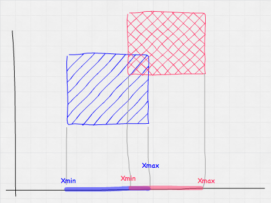
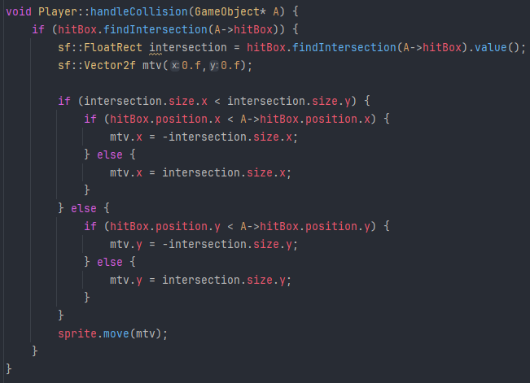

# AABB Collision

1. ### Collision Box:

Every object in a video game has a "collision box". In 2D games most of the times the representation of the box is a rectangle defined by its minimum (top-left) and maximum(bottom-right) coordinates.

An example of an object might have:
- minX, minY for the top left corner
- maxX, maxY for the bottom right corner

2. ### Collision Detection:
   
Two rectangles collide if they overlap on both axis: 
- **X axis overlap**: Object A's right side is to the right of Object B's left side, **and** Object A's left side is to the left of B's Right side
- **Y axis overlap**: Object A's bottom is below B's bottom **and** Object A's top is below Object B's bottom

)

The picture is an example of both an X and Y axis overlap.

3. ### Resolving Collisions in the context of a 2D game:

When collision is detected we need to adjust the position of the object(s) that is(are) overlaping.
     
1. ##### Calculate Penetration Depth(s):
- X-axis penetration: how far the object is inside the other horizontally
- Y-axis penetration: how far the object is inside the other vertically

1. ##### Determine the Minimum Translation Vector:
   The mtv is the shortest distance to seperate the objects from each other. To resolve the collision we must first determine the MTV:
   - Compare X and Y overlaps
   - Choose the axis with the smaller penetration depth
   - Adjust the objects position along that axis by the penetration amount (in the opposite direction)
   

- The following code snipped is from my implementation. If the player's hitBox intersects with another GameObject's hitobx then an intersection rectangle is created that is purely there to help determine the mtv's value.
- Depending on wether the playe is left / right or up / down from the colliding object we assign a value equal to the penetration to the mtv.
- Finally we resolve the collision by moving the sprite by the value of mtv. (sprite also moves the hitbox)